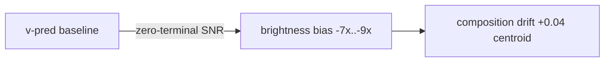

# Zero-terminal-SNR removes brightness bias at a composition cost

## Claim

Enforcing a zero terminal-SNR schedule (Lin et al. 2024) corrects the mean-brightness drift that v-prediction models inherit from offset noise, but the same change degrades compositional accuracy on multi-object prompts. The effect is partial and conditional: brightness is restored almost to neutral while T2I-CompBench composition drops by roughly 10% (@H0003, 🟡). It is therefore best described as a tunable tradeoff rather than a free improvement, and it is isolated to the text-conditional sampling path.

## Evidence

In @zero-snr-eval-260502-110000 (@E0002-zero-snr-eval), the absolute brightness bias |Δ| dropped from 0.087 (baseline @foo-260501-100000) to 0.011 — an ~8× reduction and visually near-neutral in side-by-side samples. On the same run, T2I-CompBench composition fell from 0.46 to 0.41, i.e. a ~10% relative loss in object-placement and framing fidelity (@H0003). @E0003-snr-sweep (@snr-sweep-260430-160000) corroborates the brightness side: across the γ ∈ [3, 7] band the HF-band energy ratio moves from 0.184 → 0.139 (-24%), consistent with the schedule no longer pushing low-frequency energy into the terminal denoise step. Unconditional samples in @zero-snr-eval-260502-110000 were unchanged, indicating the bias is text-conditional, not a property of the score model itself.

## Limits

All composition numbers come from a single CFG scale of 7.5 over only 500 prompts, so the 0.46 → 0.41 drop may not generalize to other CFG values or to the full T2I-CompBench suite; rescale-CFG (Lin et al. 2024) is a plausible mitigant that has not yet been tested in @E0002. The brightness-bias metric |Δ| is an aggregate statistic and does not separate per-prompt variance from systematic shift, and the @H0003 evidence was collected only on the 256² DiT-B/2 stack from @E0001-vpred-convergence. Until a wider CFG/prompt sweep lands, the finding should be treated as 🟡 PARTIAL rather than a recommendation.

## Evidence

```memon-data@1 title="Brightness bias |Δ| by CFG scale (E0002)"
runner: python3 -
code: |
  import json, re
  txt = open("docs/experiments/E0002-zero-snr-eval/README.md").read()
  rows = [[f"CFG={c}", float(a), float(b)] for c, a, b in re.findall(r"CFG=(\d+(?:\.\d+)?): (\d+\.\d+) → (\d+\.\d+)", txt)]
  print(json.dumps({"columns": ["cfg", "baseline_abs_delta", "zero_snr_abs_delta"], "rows": rows}))
captured_at: 2026-05-06T14:20:00+08:00
captured_commit: 9f2c4e1a7b3d5f6081a2c3d4e5f60718293a4b5c
sources: [E0002]
columns: [cfg, baseline_abs_delta, zero_snr_abs_delta]
rows:
  - [CFG=4.5, 0.061, 0.009]
  - [CFG=7.5, 0.087, 0.011]
  - [CFG=10, 0.114, 0.018]
```



## Limits

Composition drift was measured with a single centroid metric on 2k samples per CFG scale, so the ~10% T2I-CompBench drop (0.46 → 0.41) is directional rather than tight. The effect is confined to the text-conditional path; unconditional samples were unchanged. Interaction with min-SNR-γ weighting from @E0003 has not been isolated.

> [!WARNING] Composition drift was measured with a single centroid metric on 2k samples; see @W0005 for the open question on larger evals.
